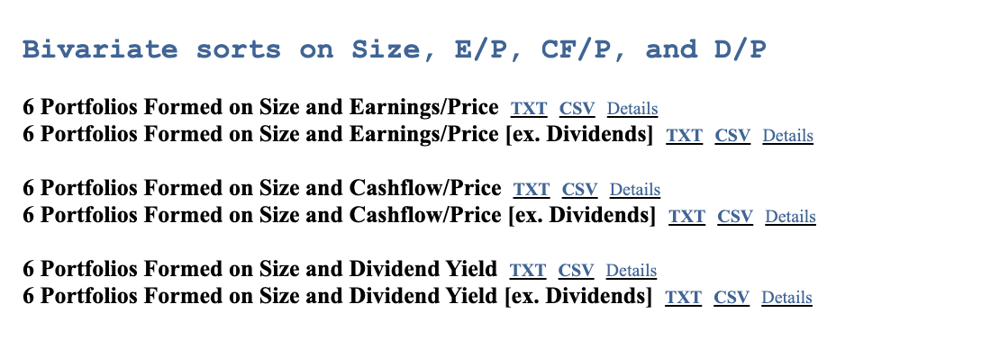
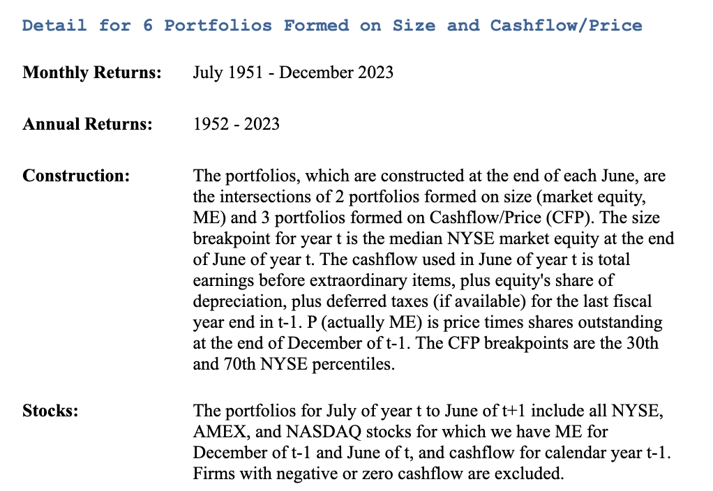
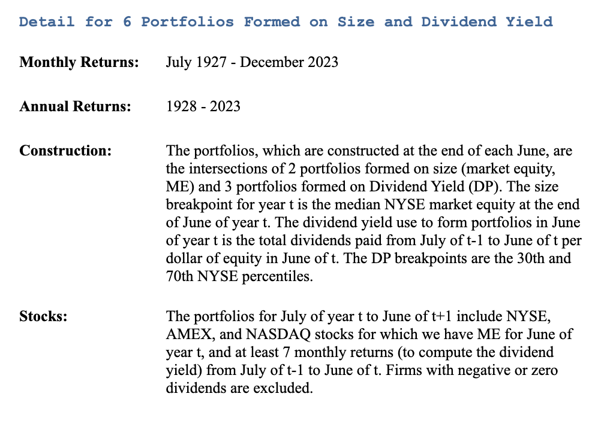
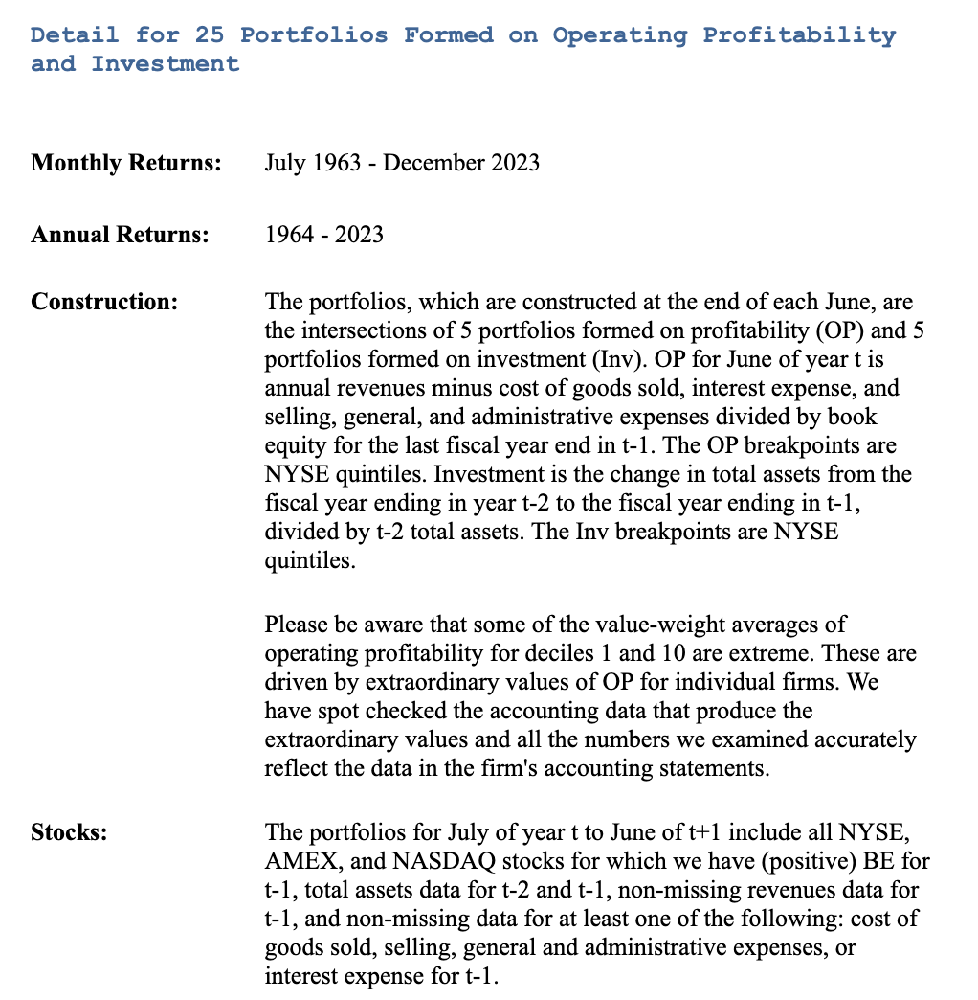
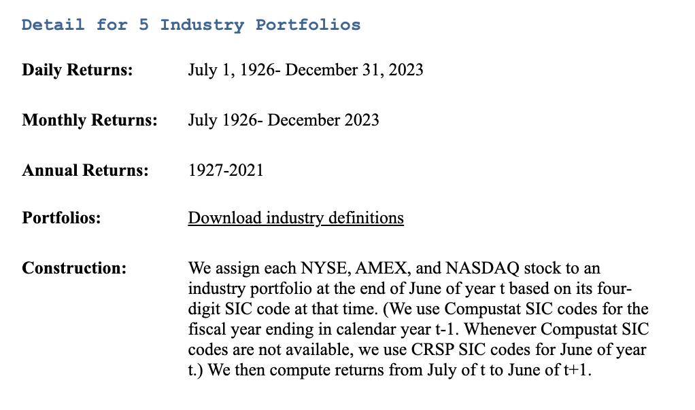

Ken French Portfolios
=====================

# Outline of Project Requirements

Project Requirement Delegation:

- Single LaTeX document- describing nature of replication w/ all tables/ charts produced by code. Adress success, challenges, data sources, and high level discussion
- Jupyter notebook touring cleaned data and analysis performed in code. Like a HW guide
- Replication: series tables figures for project with proper unit testing threshold
  - reproduce as well with updated numbers.
- Extension: perform your own smmary statistics/ charts that provide ample understanding of underlying data. Tables/ figures typeset on LaTex with captions that describe/ motivate them. Description/ takeaways
- Separate files for cleaning data to tidy format - load_x files
- Automatic generation? PyDoIt. Unit tests well constructed/ motivated/ have purpose?
- GitHub Repo clear of any copyright material? No raw data in repo. Free of any API secrets? Use .env
- Use .env file/ defaults in config.py file? START_DATE, END_DATE of analysis here. Format of .env file describe in env.example file
- No trace of .env file in repo commit history.
- Requirements.txt file outlining required packages to run project's code?
- Each member made commits/ merged pull requests?
- Each py file have a docstring outlining file action/ docstrings in functions and proper naming
- 50/182 pts for individually accomplishing tasks delgated and contributing substantial part of code to project as evidenced by commit history.

# Replicate Several Portfolios in Ken French's Data Library

Instruction:

- Establish the goals for the project
- Come prepared with a list of tasks that each team member will be primarily responsible for. Team members can and should share tasks (e.g., two people can be responsible for the LaTeX writeup whereas everyone should be involved in figuring out how to understand and clean the data).

Tasks:

- Reconstruct "Bivariate sorts on size, e/p, cf/p, d/p". Portfolios formed on size and earnings/ price, size and cashflow/price, and size and dividend yield. Use the unaggregated CRSP and Compustat data and reconstruct the portfolios that match.
  

  

  

  
- Reconstruct the "bivariate sorts on operating profitability and investment" consists of 3 files, each with 25 portfolios in it. Reconstruct from unaggregated CRSP and Compustat data.
  

  
- Reconstruct each of the "5 industry portfolios" and "49 industry portfolios" from "scratch" Use unaggregated CRSP data and reconstruct portfolios that match





# About this project

Lorem ipsum dolor sit amet, consectetur adipiscing elit, sed do eiusmod tempor incididunt ut labore et dolore magna aliqua. Ut enim ad minim veniam, quis nostrud exercitation ullamco laboris nisi ut aliquip ex ea commodo consequat. Duis aute irure dolor in reprehenderit in voluptate velit esse cillum dolore eu fugiat nulla pariatur. Excepteur sint occaecat cupidatat non proident, sunt in culpa qui officia deserunt mollit anim id est laborum.

# Quick Start

To quickest way to run code in this repo is to use the following steps. First, note that you must have TexLive installed on your computer and available in your path.
You can do this by downloading and installing it from here ([windows](https://tug.org/texlive/windows.html#install) and [mac](https://tug.org/mactex/mactex-download.html) installers).
Having installed LaTeX, open a terminal and navigate to the root directory of the project and create a conda environment using the following command:

```
conda create -n blank python=3.12
conda activate blank
```

and then install the dependencies with pip

```
pip install -r requirements.txt
```

You can then navigate to the `src` directory and then run

```
doit
```

## Other commands

You can run the unit test, including doctests, with the following command:

```
pytest --doctest-modules
```

You can build the documentation with:

```
rm ./src/.pytest_cache/README.md 
jupyter-book build -W ./
```

Use `del` instead of rm on Windows

# General Directory Structure

- The `assets` folder is used for things like hand-drawn figures or other pictures that were not generated from code. These things cannot be easily recreated if they are deleted.
- The `output` folder, on the other hand, contains tables and figures that are generated from code. The entire folder should be able to be deleted, because the code can be run again, which would again generate all of the contents.
- I'm using the `doit` Python module as a task runner. It works like `make` and the associated `Makefile`s. To rerun the code, install `doit` (https://pydoit.org/) and execute the command `doit` from the `src` directory. Note that doit is very flexible and can be used to run code commands from the command prompt, thus making it suitable for projects that use scripts written in multiple different programming languages.
- I'm using the `.env` file as a container for absolute paths that are private to each collaborator in the project. You can also use it for private credentials, if needed. It should not be tracked in Git.

# Data and Output Storage

I'll often use a separate folder for storing data. I usually write code that will pull the data and save it to a directory in the data folder called "pulled"  to let the reader know that anything in the "pulled" folder could hypothetically be deleted and recreated by rerunning the PyDoit command (the pulls are in the dodo.py file).

I'll usually store manually created data in the "assets" folder if the data is small enough. Because of the risk of manually data getting changed or lost, I prefer to keep it under version control if I can.

Output is stored in the "output" directory. This includes tables, charts, and rendered notebooks. When the output is small enough, I'll keep this under version control. I like this because I can keep track of how tables change as my analysis progresses, for example.

Of course, the data directory and output directory can be kept elsewhere on the machine. To make this easy, I always include the ability to customize these locations by defining the path to these directories in environment variables, which I intend to be defined in the `.env` file, though they can also simply be defined on the command line or elsewhere. The `config.py` is reponsible for loading these environment variables and doing some like preprocessing on them. The `config.py` file is the entry point for all other scripts to these definitions. That is, all code that references these variables and others are loading by importing `config`.

# Dependencies and Virtual Environments

## Working with `pip` requirements

`conda` allows for a lot of flexibility, but can often be slow. `pip`, however, is fast for what it does.  You can install the requirements for this project using the `requirements.txt` file specified here. Do this with the following command:

```
pip install -r requirements.txt
```

The requirements file can be created like this:

```
pip list --format=freeze
```

## Working with `conda` environments

The dependencies used in this environment (along with many other environments commonly used in data science) are stored in the conda environment called `blank` which is saved in the file called `environment.yml`. To create the environment from the file (as a prerequisite to loading the environment), use the following command:

```
conda env create -f environment.yml
```

Now, to load the environment, use

```
conda activate blank
```

Note that an environment file can be created with the following command:

```
conda env export > environment.yml
```

However, it's often preferable to create an environment file manually, as was done with the file in this project.

Also, these dependencies are also saved in `requirements.txt` for those that would rather use pip. Also, GitHub actions work better with pip, so it's nice to also have the dependencies listed here. This file is created with the following command:

```
pip freeze > requirements.txt
```

### Alternative Quickstart using Conda

Another way to  run code in this repo is to use the following steps.
First, open a terminal and navigate to the root directory of the project and create a conda environment using the following command:

```
conda env create -f environment.yml
```

Now, load the environment with

```
conda activate blank
```

Now, navigate to the directory called `src`
and run

```
doit
```

That should be it!

**Other helpful `conda` commands**

- Create conda environment from file: `conda env create -f environment.yml`
- Activate environment for this project: `conda activate blank`
- Remove conda environment: `conda remove --name blank --all`
- Create blank conda environment: `conda create --name myenv --no-default-packages`
- Create blank conda environment with different version of Python: `conda create --name myenv --no-default-packages python` Note that the addition of "python" will install the most up-to-date version of Python. Without this, it may use the system version of Python, which will likely have some packages installed already.

## `mamba` and `conda` performance issues

Since `conda` has so many performance issues, it's recommended to use `mamba` instead. I recommend installing the `miniforge` distribution. See here: https://github.com/conda-forge/miniforge
